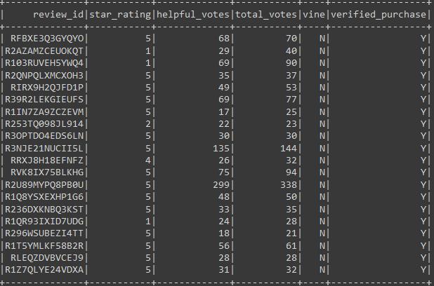
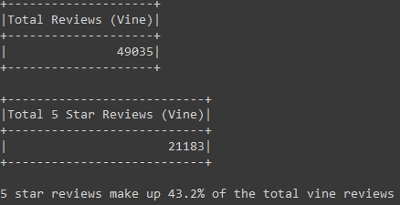
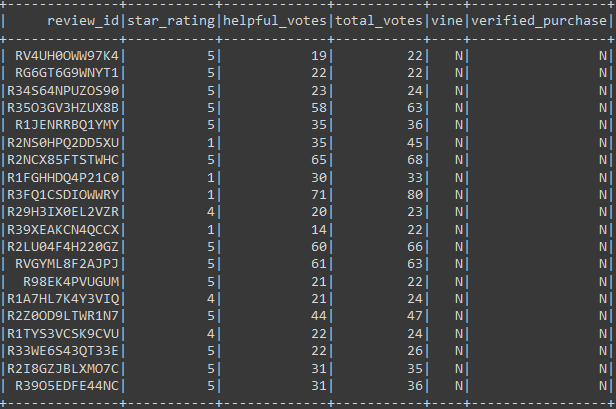
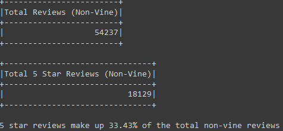

# Amazon_Vine_Analysis

## Overview of the Analysis
### Purpose
The purpose of this analysis is to determine if there is any bias toward favorable reviews from Vine member for digital video downloads. 

## Results 
According to the dataframe and statistics below, there were 49,035 vine reviews and 54,237 non-vine reviews. Of the vine reviews 21,183 were 5 stars and of the non-vine reviews 18,129 were 5 stars. Thus, 5 star reviews make up 43.2% of the vine reviews and 33.43% of the non-vine reviews.

## Summary
Based on the fact that 5 star reviews make up 43.2% of the vine reviews and 33.43% of the non vine reviews which would count as positivity bias. To further prove (or disprove) this bias, it'd be wise to process the actual text in the review and develop positivity scores for both the vine and non vine reviews then compare the results.
